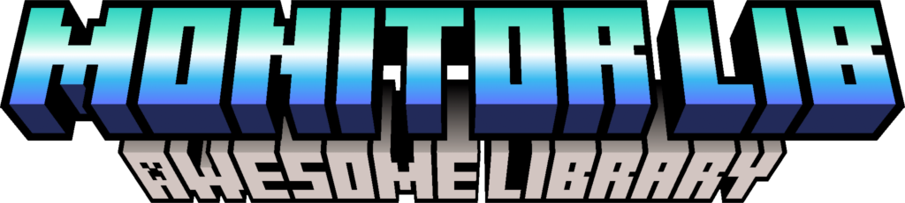

<!--suppress ALL -->
<div align="center">
    A Minecraft Plugin Library to make your life developing, easier.
</div>

<br/>

<div align="center">
  
</div>

- Item, Skull and Entity Creators.
- Material, Enchantment, Potion Utilties.
- Adventure Component and Readability Utilties.

<br/>

<div align="center">
  
</div>

You can find the Wiki for the Library [here](https://github.com/HeadMonitor/MonitorLib/wiki)!

## Maven Setup
```xml
Coming Soon
```

## Manual Setup
If you want to use the Library witout **Build Automation Tools** you can download the **.jar** and add it
as a dependency in your IDE.

<br/>

<div align="center">
  
</div>

You can get **Support**, **Request a Feature** or **Report a Bug** through a [GitHub Issue](https://github.com/HeadMonitor/MonitorLib/issues) 
or through my [Discord](https://discord.gg/GcmTStpyYr). I will my our best to help you out!
